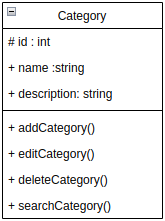

# Golang CRUD API minimal

API written in Golang that stores information in a SQLite database. Implements CRUD operations for the Category entity of the Product Management domain.

## Domain model metadata

Domain: Product Management

    Category: (Id, Name, Description)

Domain model using class diagram notation

## REST API

### Start the project

Build the API

    go build ./cmd/api
    go build -o productsAPI ./cmd/api/

Execute the API

    ./api
    ./productsAPI

Execute the API with migrations

    ./api -migrate
    ./productsAPI -migrate
    

Only execute the API with migrations

    go run ./cmd/api -migrate

## API Endpoints

    curl --location 'localhost:9090/health'

### Category 

    curl --location 'http://localhost:9090/categories' \
    --header 'Content-Type: application/json' \
    --data '{ "name": "Footwear", "description": "Footwear and tennis" }'

    curl --location 'http://localhost:9090/categories/get/6'

    curl --location --request PUT 'http://localhost:9090/categories/update/6' \
    --header 'Content-Type: application/json' \
    --data '{ "Name": "categoria", "Description": "categoria nueva" }'
    
    curl --location 'http://localhost:9090/categories/all'

    curl --location --request DELETE 'http://localhost:9090/categories/delete/6'

### Product

    curl --location 'http://localhost:9090/products' \
    --header 'Content-Type: application/json' \
    --data '{ "Name": "car", "Description": "Hot weels car", "Price": 2000, "category_id": 5 }'

    curl --location 'http://localhost:9090/products/get/6'

    curl --location --request PUT 'http://localhost:9090/products/update/6' \
    --header 'Content-Type: application/json' \
    --data '{ "Name": "phantom car", "Description": "Hasbro panthom car", "Price": 4000, "category_id": 5 }'

    curl --location 'http://localhost:9090/products/all'

    curl --location --request DELETE 'http://localhost:9090/products/delete/6'

### API Collection

You can find the API collections [here](Golang-CRUD-API.postman_collection.json)